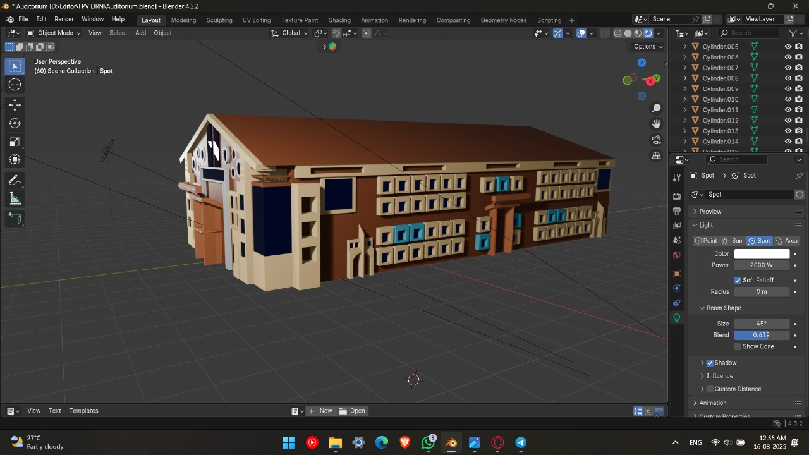
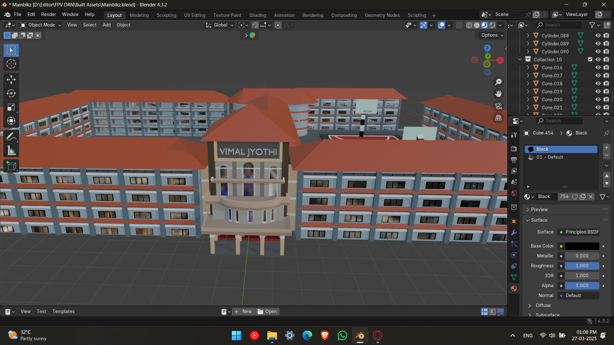

# 🚁 FPV Drone Simulation — Unity 3D & VR

A high-fidelity **First-Person View (FPV) drone simulation** developed using **Unity 3D and Blender**, designed to provide an immersive drone-view experience with realistic flight controls and a virtual campus environment.

## 📌 Project Overview

This project explores the development of an interactive FPV drone simulation that allows users to experience a **drone's perspective in a virtual environment**.

The simulation combines 3D environment design, drone movement, flight controls, and VR interaction to create an immersive experience suitable for **simulation, visualization, and interactive training applications**.

## 🎯 Key Features

* 🚁 FPV drone-view simulation
* 🏫 Virtual campus environment
* 🎮 Interactive drone movement and controls
* 🥽 VR-based immersive experience
* 🌍 3D environment designed using Blender
* ⚙️ Realistic-style flight and movement simulation
* 👁️ First-person drone perspective
* 🧪 Campus-based demonstration

  
## 🥽 VR Campus Demonstration

The project was demonstrated as an immersive **VR campus exploration experience using an FPV drone-view perspective**.

Users could experience the virtual campus from the simulated drone's viewpoint, providing an interactive way to explore different campus locations and environments.

### Campus Environment

The virtual environment includes campus locations such as:

* 🏫 Auditorium
* 🏢 Academic/department blocks
* 🌳 Campus surroundings
* 🚁 FPV drone-view navigation

### Implementation & Demonstration

The following images show different stages of the virtual environment, implementation, and campus demonstration:

## 🛠️ Technologies Used

* **Unity 3D** — Simulation development and interactive environment
* **Blender** — 3D modelling and environment assets
* **VR** — Immersive visualization and interaction
* **C#** — Unity scripting and simulation logic

## 📐 System Documentation

### System Architecture

### Data Flow Diagram

### Use Case Diagram

## 🧩 Project Components

### 🚁 Drone Simulation

The drone is represented from a first-person perspective to simulate the visual experience of operating an FPV drone.

### 🏫 Virtual Campus

A 3D campus environment was developed to provide a realistic setting for the drone simulation and VR demonstration and have a immesrive campus tour.

### 🥽 VR Experience

The simulation was demonstrated in VR to provide an immersive drone-view experience and allow users to explore the virtual environment.

## 📸 Project Demonstration

The following screenshots provide a visual overview of the FPV drone simulation, virtual campus environment, and implementation stages.

### 🏫 Campus & Environment

### 🚁 FPV Simulation

### 🥽 VR / Interactive Demonstration

### ⚙️ Additional Implementation

## 🎓 Project Context

This project was developed as part of my academic and practical exploration of **3D simulation, virtual reality, immersive interaction, and drone-based visualization**.

It provided hands-on experience with Unity 3D, Blender, interactive 3D environments, and VR-based simulation.

## 🚀 Future Scope

* More realistic drone physics
* Expanded campus/environment exploration
* Improved VR interactions
* Additional flight controls
* Real-time environmental effects
* Integration with physical drone controllers

## 👩‍💻 Author

**Ann Maria**
B.Tech Computer Science & Design Engineering
Vimal Jyothi Engineering College

* GitHub: [annmaria5804-2004](https://github.com/annmaria5804-2004)
* LinkedIn: [Ann Maria](https://www.linkedin.com/in/ann-maria-869154322/)

---

⭐ This repository documents the FPV drone simulation project and its VR-based campus demonstration.
